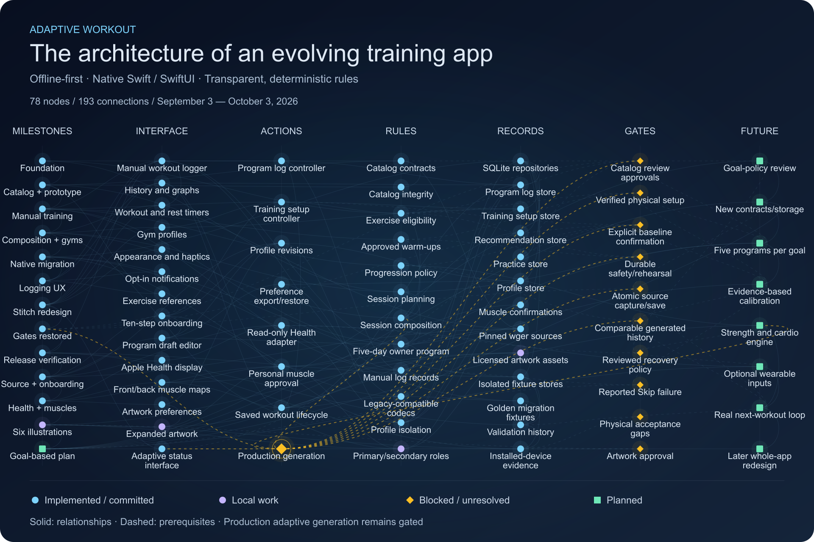

# Development network

Snapshot: October 3, 2026. The map covers the project’s development history through release-branch commit `a2bcbd2` and local artwork/planning work present on that date. It includes work beyond the current `main` branch. Local and planned nodes do not imply merged code or production acceptance.

## How to read the map

Each node represents a milestone, feature, service, rule, record, unresolved gate or future phase. Solid links summarize development or architectural relationships; dashed links mark unresolved prerequisites. Connections are schematic, not neural-network weights, runtime traces or a literal call graph.

- Circles in blue: implemented capabilities or committed milestones.
- Circles in purple: local upgrades.
- Diamonds in amber: blocked or unresolved requirements.
- Squares in green: planned work.

Production adaptive generation remains unavailable. Manual/practice logs, Health observations and muscle-history confirmations do not bypass catalog review, verified setup, explicit baseline confirmation or atomic saving. Historical validation is summarized from repository records. The documentation change was separately checked with formatting, package build/tests and a generic unsigned iOS build; those checks do not establish new device acceptance.

## Node inventory

### Milestones

- **Project foundation** (implemented / committed): Offline-first adaptive training, explicit specifications, deterministic recommendations. Foundation details Initial Flutter/Dart project and product/science/security/testing documentation. Engine selects exercises from explicit goals, constraints and approved evidence. Training science and product decisions require approval before implementation. f060593 · initial repository commit
- **Exercise catalog + first iPhone flow** (implemented / committed): Pinned wger seed, validated catalog contracts, integrity checks and guarded eligibility. Catalog and prototype details Provenance, licensing, taxonomies, validation bounds and SHA-256 manifest checks. Catalog mapping plus sample workout interactions for iPhone. Separate safety and exercise-eligibility gates; unknown evidence blocks selection. a639b67 → d51301f · 9 commits
- **Real manual training + durable storage** (implemented / committed): Five-day owner program, offline logs, setup preparation and recommendation history backend. Training foundation details Pinned benchmark catalog; versioned owner prescriptions, ordered blocks and paired sets. SQLite logging with snapshots, corrections, receipts and restart-safe history. Approved progression/warm-up rules and user-controlled scheduling; setup revisions preserve explicit baseline boundaries. Manual and practice records stay separate from generated recommendation evidence. d8c7467 · 541bfd0 · 982e30f
- **Composition, gyms and workout management** (implemented / committed): Standalone session composition, saved-workout lifecycle, gym profiles and consolidated workout/history UI. Feature details Saved-session management and protected manual deletion. Local gym equipment inventory; inventory does not verify an individual machine. Session/rest timers, appearance settings and inline history presentation. Historical Flutter baseline: 395 tests and analyzer passed, as recorded in migration documentation. 9b86949 · 52db7d8 · c28d22f
- **Native Swift / SwiftUI migration** (implemented / committed): App and engine ported; Xcode becomes the maintained workflow, targeting iOS 17+. Migration details WorkoutDomain → WorkoutApplication → repository boundaries → WorkoutPersistence. Preserved legacy JSON bytes, integer load/timestamps, audit revisions and SQLite contracts. Golden parity fixtures; Flutter retired from the maintained runtime. Recorded native baseline: 115 package tests passed. Source parity does not establish installed-data transfer. b1da05d → 9a164ac · 5 commits
- **Native workout usability** (implemented / committed): Copy previous actuals, next-set advancement, optional notifications and offline exercise references. Usability and verification Manual logging conveniences, history/filter navigation and workout feedback. Searchable licensed exercise-name references; reference records do not unlock recommendations. Native mockup flows and simulator checks across iOS versions; larger-text and dark-mode interactions exercised. Documented test counts differ across feature slices; they are not one cumulative total. 7b5ed49 · migration/test reports
- **Stitch redesign + adaptive interface** (implemented / committed): Training shell, last-time history, glass timers and gym checklist; adaptive/calibration screens added. Design and acceptance details Stitch visual direction adapted to native manual-workout semantics and saved-record behavior. Debug-only design references remain separate from normal app flows. Sep 28 documented physical run: 125 hosted tests and 10 distinct UI scenarios passed across full run and reruns. Adaptive screen/calibration implementation existed, but its initial unlock behavior required remediation. cf87ef6 · 7f03060 · 7de61b1 · 7a50b73
- **Adaptive safety gates restored** (implemented / committed): Manual logs cannot silently establish verified baselines; production generation remains unavailable. Correction details Explicit setup and baseline confirmation required. Unreviewed owner catalog placeholders remain disabled. Atomic generation source deliberately reports unavailable; app controller remains unregistered. Recorded remediation: 132 package tests, formatting, build and analysis passed. 5f9fa57 · historical fixed-week unlock is not current approved behavior
- **Release integration + installed-flow testing** (implemented / committed): Branches reconciled; summary/set-entry bugs fixed; restart, correction, finish and history exercised. Verification and incident 154 hosted core tests and all 19 ordinary UI cases have passing physical results across a full run and targeted rerun. Separate isolated imported-history restart test passed. Test-phone cleanup unexpectedly cleared the whole app sandbox. Preservation of prior normal data on that phone cannot be claimed. Airplane-mode, power-loss, haptic comfort and spoken VoiceOver acceptance remain separate. 213922e → 9111edc · release/migration evidence
- **Source candidates + personalized onboarding** (implemented / committed): Real source provenance and ten resumable setup steps, profile isolation, program drafts and optional HealthKit. Implemented scope and limits 25 pinned wger source records: 22 disabled review candidates, 3 rejected muscle mappings. Immutable profile revisions, validated export/restore, schedule/environment preferences and structured program drafts. Edited drafts are not executable replacement programs. Read-only Health samples stay in memory and do not change prescriptions; full authoritative setup remains unfinished. Onboarding slice recorded 154 package tests and targeted simulator flows passed. 28b66e5 · 414a425
- **Health display + personal muscle history** (implemented / committed): Visible Health observations, explicit muscle confirmations, front/back maps and artwork preferences. Muscle presentation evolution Source primary/secondary tags; profile-scoped confirmations label past manual history without rewriting logs. Selectable front/back body map → curved segmented contours → Male/Female/Neutral preferences. Demographics affect artwork only. Last trained is descriptive history, not a fatigue or recovery score. Recorded committed preference slice: 162 package tests, build/analysis and targeted UI passes. ac64dcb → a2bcbd2 · 4 commits
- **Six native muscle illustrations** (local work): Local upgrade: offline licensed artwork, expansion, text selection, appearance refresh and attribution. Local state and documented evidence Male/Female/Neutral × Front/Back, pinned source hashes, geometry tooling and MIT attribution. Uncommitted artwork/resources, UI regressions and history-role refinements are present in this checkout. Migration document records 164 package tests, 6 conversion tests, 4 hosted artwork tests and 4 focused UI scenarios passed. Subsequent signed installation/launch recorded; all rows/schemas matched across 65 preexisting SQLite stores. Physical artwork interaction, anatomical approval and spoken VoiceOver acceptance remain unverified. ADR 0022 · local changes · documented historical checks, not rerun for this visualization
- **Goal-based engine direction + science review** (planned): Engine prioritized; readiness becomes evidence-based per activity, with no fixed-week unlock. Approved direction / unfinished implementation Five reviewed program options per supported goal; muscle building is the first evidence-review goal. Immediate starter training, explicit calibration, strength/cardio planning and optional cross-brand wearable enrichment. Evidence review and candidate rule tables drafted; exact thresholds and population policies remain unapproved. Broken Skip reported during real training; reproduction and regression fix are pending. Whole-app redesign deferred. This plan update has not started engine implementation. ADAPTIVE_ENGINE_PLAN.md · ADR 0023 · local planning/research documents

### Interface

- **Manual workout logger** (implemented / committed): Save actual sets, effort and feedback; corrections, early finish and deletion preserve manual provenance.
- **History and graphs** (implemented / committed): Offline descriptive history and last-time context; not generated progression evidence.
- **Workout and rest timers** (implemented / committed): Presentation-only session/rest timing.
- **Gym profiles** (implemented / committed): Local inventories; inventory does not verify a physical setup.
- **Appearance and haptics** (implemented / committed): System/light/dark preferences and optional native haptic cues.
- **Opt-in notifications** (implemented / committed): Native optional alerts with testable notification boundaries.
- **Exercise references** (implemented / committed): Offline searchable licensed source names and metadata; no recommendation approval.
- **Ten-step onboarding** (implemented / committed): Resumable preferences and profile-scoped setup; final review does not activate generation.
- **Program draft editor** (implemented / committed): Structured sets/reps/rest/order/pairing/lock intent; edited drafts are not executable.
- **Apple Health display** (implemented / committed): Read-only sample display, source/time/unit metadata; no prescription changes.
- **Front/back muscle maps** (implemented / committed): Selectable muscle source tags and confirmed last-trained history; no fatigue formula.
- **Artwork preferences** (implemented / committed): Male/Female/Neutral defaults and explicit override; no demographic training rules.
- **Expanded artwork** (local work): Six pinned offline drawings, accessible text selection, Reduce Motion and MIT attribution.
- **Adaptive status interface** (implemented / committed): Blocked reasons and calibration presentation; production controller remains unregistered.

### Actions

- **Program log controller** (implemented / committed): Coordinates pending actions, validation, retry identity and durable acknowledgement.
- **Training setup controller** (implemented / committed): Coordinates preferences, equipment drafts and explicit starting-load confirmation.
- **Profile revisions** (implemented / committed): Validated immutable revisions, expected-revision conflicts and exact retries.
- **Preference export/restore** (implemented / committed): Validated profile and draft JSON; no history, evidence or Health import.
- **Read-only Health adapter** (implemented / committed): Selected categories, 30-day memory-only snapshots, duplicates/nonfinite/overlap validation.
- **Personal muscle approval** (implemented / committed): Explicit profile-scoped confirmations label completed history without rewriting workouts.
- **Saved workout lifecycle** (implemented / committed): Immutable prescriptions, correction audit, restart and protected deletion boundaries.
- **Production generation** (blocked / unresolved): Deliberately unavailable atomic source and unregistered live controller.

### Rules

- **Catalog contracts** (implemented / committed): Versioned identities, provenance, licensing, taxonomies and bounds.
- **Catalog integrity** (implemented / committed): Pinned manifests and deterministic SHA-256 source/resource checks.
- **Exercise eligibility** (implemented / committed): Independent catalog/safety/setup gates; unknown evidence blocks selection.
- **Approved warm-ups** (implemented / committed): External/bodyweight/assistance policies, explicit feedback and interruption inputs.
- **Progression policy** (implemented / committed): Approved standalone deterministic policy; requires comparable generated evidence.
- **Session planning** (implemented / committed): Explicit dates, weekdays and ordered occurrences; missed days do not discard sessions.
- **Session composition** (implemented / committed): Standalone deterministic composition and duration advisory; not production activation.
- **Five-day owner program** (implemented / committed): Versioned constant prescriptions, ordered blocks and paired supersets.
- **Manual log records** (implemented / committed): Actuals, completion and corrections remain recommendationEligible=false.
- **Legacy-compatible codecs** (implemented / committed): Canonical JSON, exact integer timestamps/loads and receipt equivalence.
- **Profile isolation** (implemented / committed): New profiles do not inherit owner evidence or reassign historical records.
- **Primary/secondary roles** (local work): Descriptive source and confirmed-history roles; local refinements retained.

### Records

- **SQLite repositories** (implemented / committed): Bound parameters, transactions, immutable revisions and fail-closed reads.
- **Program log store** (implemented / committed): Frozen prescriptions, recorded actuals, receipts and correction history.
- **Training setup store** (implemented / committed): Revisioned equipment and starting-load preparation.
- **Recommendation store** (implemented / committed): Snapshots and immutable saved lifecycle contracts; activation remains gated.
- **Practice store** (implemented / committed): Separate developer practice evidence; never recommendation inputs.
- **Profile store** (implemented / committed): Immutable scoped preferences, onboarding progress and structured drafts.
- **Muscle confirmations** (implemented / committed): Separate scoped immutable confirmation revisions; stale source changes deactivate them.
- **Pinned wger sources** (implemented / committed): 25 owner candidates: 22 disabled review candidates, 3 rejected mappings.
- **Licensed artwork assets** (local work): Pinned react-muscle-highlighter snapshot, six native drawings, hashes and MIT attribution.
- **Isolated fixture stores** (implemented / committed): Tests/reset routing stay separate from normal data and private source records.
- **Golden migration fixtures** (implemented / committed): Dart/native byte parity and exact loads/timestamps/storage contracts.
- **Validation history** (implemented / committed): Documented package, hosted and UI checks; historical results, not rerun for this visualization.
- **Installed-device evidence** (implemented / committed): Documented tested flows and later install/launch/store comparisons; acceptance limits retained.

### Gates

- **Catalog review approvals** (blocked / unresolved): Product/science/safety/equipment/license reviews and exact exercise bindings remain incomplete.
- **Verified physical setup** (blocked / unresolved): Explicit machine convention, setting ladders, revisions and confirmation.
- **Explicit baseline confirmation** (blocked / unresolved): Manual observations cannot silently become executable starting targets.
- **Durable safety/rehearsal** (blocked / unresolved): Persist current assessments and applicable rehearsal attestations.
- **Atomic source capture/save** (blocked / unresolved): One consistency boundary: source revisions, freshness, prescription, idempotent receipt.
- **Comparable generated history** (blocked / unresolved): Generated performance provenance, corrections and context isolation needed for progression.
- **Reviewed recovery policy** (blocked / unresolved): No approved automatic fatigue score/countdown or physiology-driven lifting change.
- **Reported Skip failure** (blocked / unresolved): Owner used zero as workaround; reproduction, diagnosis and regression fix are pending.
- **Physical acceptance gaps** (blocked / unresolved): Spoken VoiceOver, physical workout usability, haptics, airplane-mode and power-loss checks remain separate.
- **Artwork approval** (blocked / unresolved): Anatomical/clinical and physical artwork interaction acceptance unverified.

### Future

- **Goal-policy review** (planned): Muscle building first; source-to-rule tables and population thresholds need review.
- **New contracts/storage** (planned): Readiness, observation, explanation, migration/rollback and atomic design.
- **Five programs per goal** (planned): Reviewed starter options, executable selection and scheduling.
- **Evidence-based calibration** (planned): Per-activity comparable evidence plus explicit setup/baseline confirmation; no fixed-week unlock.
- **Strength and cardio engine** (planned): Reviewed selection/progression/recovery/time handling and transparent explanations.
- **Optional wearable inputs** (planned): Cross-brand supported physiology, gaps, staleness and no-tracker fallback.
- **Real next-workout loop** (planned): Protected installed flow: calibrate, generate, execute, correct and next session.
- **Later whole-app redesign** (planned): Workout-first fewer taps and reduced phone attention; deferred behind engine work.

## Evidence and maintenance

The current checkout was inspected alongside `ARCHITECTURE.md`, `SWIFT_MIGRATION_STATUS.md`, `RELEASE_LOOP_STATUS.md`, `PERSONALIZED_ONBOARDING_STATUS.md` and the local October 3 engine plan. The later release/planning files may not yet be available on `main`; this is a dated snapshot rather than a live readiness dashboard.

The README uses a local PNG; the companion SVG preserves editable vector geometry. Neither asset loads scripts, contacts an external service or changes app behavior. Update the image and this inventory together when development changes.
